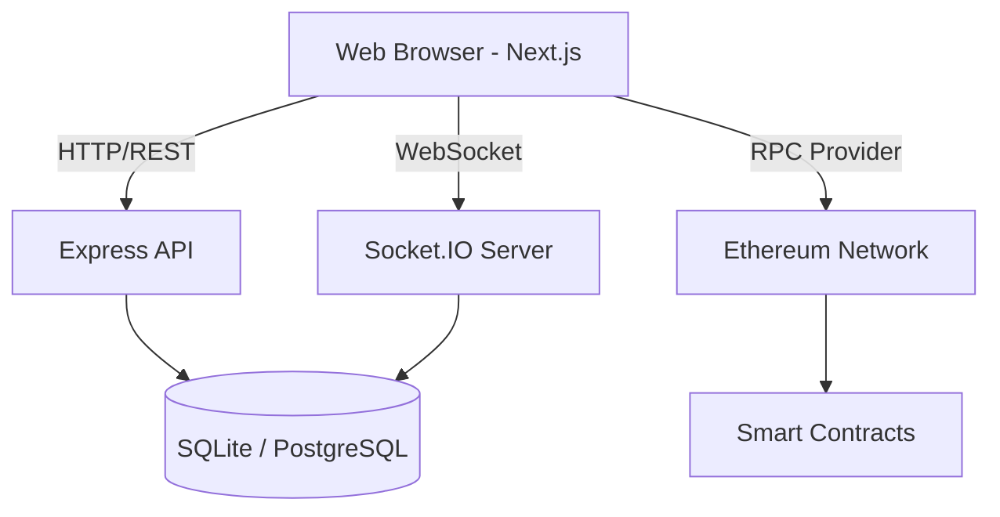

# Architecture

Byte Bets is structured as a fullstack monorepo with three primary domains: Frontend, Backend (Game Server), and Blockchain (Smart Contracts).

## System Diagram

## 1. Frontend (`/frontend`)
- **Next.js 15 App Router**: Powers the UI and routing.
- **Wagmi & Web3Modal**: Manages wallet connections and blockchain read/write state.
- **React Three Fiber**: Renders the 3D background elements without blocking the main UI thread (lazy loaded).
- **Tailwind CSS & Framer Motion**: Provides the UI with a premium glassmorphic feel and fluid animations.

## 2. Game Server (`/game-server`)
- **Node.js & Express**: Handles standard REST API requests (e.g., fetching leaderboard, user profiles).
- **Socket.IO**: Manages real-time bidirectional events (e.g., Crash game multipliers, live betting feeds).
- **Prisma ORM**: Interfaces with the database. SQLite is used for local development, and PostgreSQL is recommended for production.
- **Zod**: Ensures all incoming payloads (HTTP and WebSocket) are strictly validated.

## 3. Blockchain (`/contracts`)
- **Hardhat**: Compiles and tests the smart contracts.
- **Solidity**: Contains the core logic for deposits, withdrawals, and provably fair cryptographic verification.
